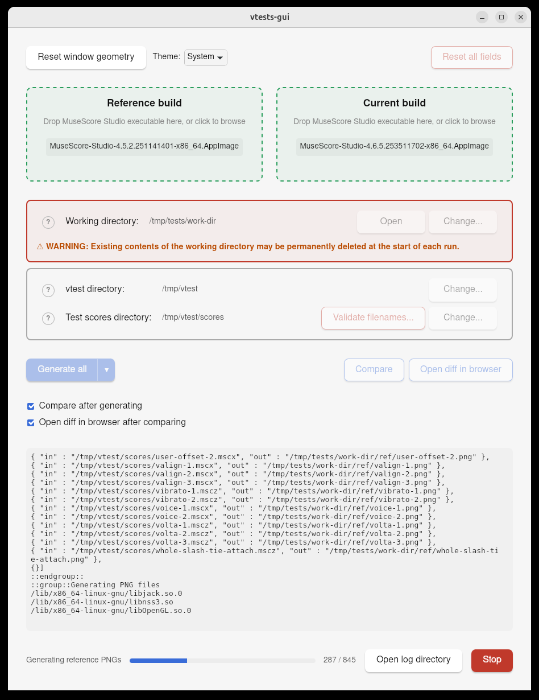

# vtests-gui

A desktop GUI for running [MuseScore Studio](https://github.com/musescore/MuseScore) visual regression tests (`vtests`) and comparing reference vs. current renders.

Wraps the `vtest-generate-pngs.sh` and `vtest-compare-pngs.sh` scripts shipped with MuseScore Studio, and streams their output into an embedded terminal. Built with [Tauri 2](https://tauri.app/) (Rust backend + vanilla HTML/CSS/JS frontend).



## Acknowledgments

Developed with the assistance of [Claude Code](https://claude.com/claude-code), Anthropic's agentic coding CLI.

## Features

- Pick two MuseScore Studio builds (reference and current) via drag-and-drop or file picker
- Generate PNG renders for either build, or both in sequence
- Compare the two render sets and open the resulting HTML diff report in the browser
- Detect and batch-rename test score filenames that could trip up the vtest scripts
- Cross-platform: Linux (AppImage), macOS (.app), Windows (.exe)
- Remembers paths and preferences between runs
- Light / dark / system theme
- Cancel a running job at any time
- Per-session log file (5-run rotation) in the OS app-data directory, openable from the UI

## Prerequisites

### Runtime (to use the app)

- A clone of the [MuseScore Studio repository](https://github.com/musescore/MuseScore) — the app runs the scripts from its `vtest/` directory.
- One or two MuseScore Studio builds to test (`.AppImage` on Linux, `.app` on macOS, `.exe` on Windows).
- A directory of MuseScore Studio project files to render.
- **Windows only:** `bash` plus standard Unix tools (ImageMagick, coreutils) on `PATH`. Install [Git Bash](https://git-scm.com/download/win) or enable WSL.
- **Linux / macOS:** ImageMagick and coreutils (usually preinstalled on macOS; install via your package manager on Linux).

### Build (to compile from source)

- [Node.js](https://nodejs.org/) 18+ and npm
- [Rust](https://rustup.rs/) (stable toolchain)
- Tauri 2 platform dependencies — see the [Tauri prerequisites guide](https://tauri.app/start/prerequisites/) for your OS (e.g. `webkit2gtk` on Linux, Xcode Command Line Tools on macOS, WebView2 on Windows).

## Build

```bash
git clone https://github.com/davidstephengrant/vtests-gui.git
cd vtests-gui
npm install
```

### Run in development mode

```bash
npm run tauri -- dev
```

This launches the app with hot-reload on the frontend.

### Build a release bundle

```bash
npm run tauri -- build
```

Installers and binaries are written to `src-tauri/target/release/bundle/`.

## Usage

1. **Set the two MuseScore Studio executables** by dropping them onto the *Reference build* and *Current build* zones, or clicking to browse.
2. **Set the three directories:**
   - *Working directory* — where the app writes `ref/`, `current/`, and `diff/` subdirectories. **Existing contents may be deleted at the start of each run.**
   - *vtest directory* — the `vtest/` folder inside your MuseScore Studio repository clone.
   - *Test scores directory* — the folder containing the `.mscz` / `.mscx` files to render.
3. **Generate and compare:**
   - *Generate reference* / *Generate current* — render one build's PNGs.
   - *Generate all* — render both in sequence.
   - *Compare* — diff the two render sets; opens `diff/vtest_compare.html` in your browser when diffs are found (toggleable).
   - *Generate all and compare* — the full pipeline in one click.

### Test score filenames

The vtest scripts are fairly strict about what they'll accept as a filename. Spaces, parentheses, `#`, `&`, non-ASCII characters and the like can cause the shell pipelines inside `vtest-generate-pngs.sh` / `vtest-compare-pngs.sh` to misquote paths, skip files silently, or fail outright. In practice, anything outside `A–Z`, `a–z`, `0–9`, `.`, `_`, and `-` is best avoided.

Whenever the *Test scores directory* is loaded (at startup or via *Change...*), the app scans it recursively and prints a warning in the terminal if any file has an invalid name. Click **Validate filenames...** next to the directory to open a preview showing each offending file and its proposed replacement — runs of invalid characters are collapsed into a single `_`, and name collisions are resolved by appending `_1`, `_2`, … before the extension so nothing gets overwritten. Confirm to apply the renames; cancel to back out.

### Session logs

Each app session writes a timestamped log file containing user interactions (button clicks, path changes, settings toggles), the commands spawned for each run, their unfiltered stdout/stderr, and any info/warning/error messages surfaced in the terminal. The five most recent logs are kept; older ones are pruned at startup. Click **Open log directory** (below the terminal) to reveal them in the OS file manager. Typical locations:

- **Linux:** `~/.local/share/no.davidgrant.vtests-gui/logs/`
- **macOS:** `~/Library/Logs/no.davidgrant.vtests-gui/`
- **Windows:** `%LOCALAPPDATA%\no.davidgrant.vtests-gui\logs\`

## Project layout

```
src/           Frontend (HTML, CSS, JS) — served by Tauri at runtime
src-tauri/     Rust backend — Tauri commands for running scripts,
               managing the workdir, etc.
```

## License

Released under the [GNU General Public License v3.0 or later](LICENSE).
